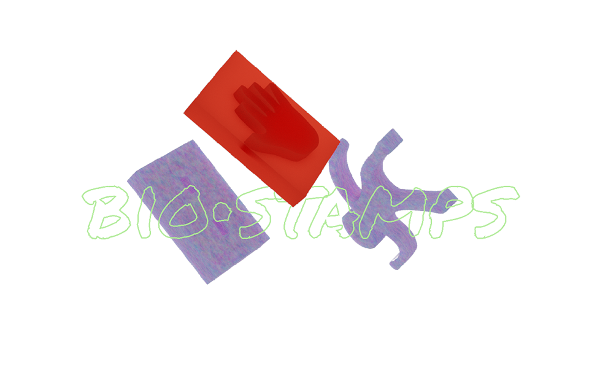
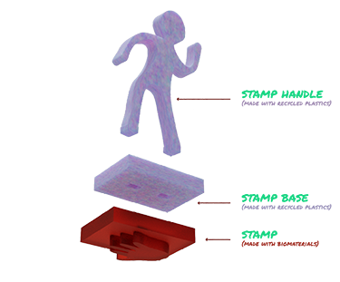

# BIOSTAMPS

### IDEATION



A stamp kit made made fully from waste/bio material for kids to construct and play with.



The point was to test out different cutting and mold making
making techniques to realize the best results in terms of making successful stamps.



We are already executing our interventions together, and we are working in the areas of creative uses of waste, specifically in children’s toys and child play. We are currently working on building several toys made completely from waste and biodegradable materials in order to proceed with our interventions.

### PURPOSE


Our artifact is a collection of stamps with exchangeable handles that kids can use to make drawings our map out graphics. We went for a simple object and decided not to reinvent the wheel, but rather, question the way it’s made and challenge it.

### PLANNING AND EXECUTION

As we are already have common values and aligned interests, it was easy for us to pick something and go with it. We then proceeded in writing down all the steps required to reach our final result. You can find the list below, and a thorough breakdown of the instructions to replicate the stamps.

Overall, we had 4 main aspects to deal with: (1) design, (2) materials, (3) packaging, (4) finalizing + execution.

### DIAGRAM

Here is a diagram to explain the main components that make up the stamps.

### DESIGN PROCESS

The design process was focused on 3 main components:

#### _1. Stamp drawing:_

We drew the stamp as sketches in a notebook and later selected 7 designs. We then scanned and traced the designs on illustrator as vector drawings.

#### _2. Handle design:_

Same process as above, but a different design.

#### _3. Stamp Base:_

We had to think of the main shape of the stamp and the size of it, we also had to think of the way the different handles we designed can be replaced with each other by being attachable and removable from the stamp base.

## HONEST DESIGN

We mainly focused on the laser cut machine for this exercise, and how we can create molds (whether negative or positive) from different materials through the laser cutting technique. We had also employed the press to produce melted plastic sheets for the stamp base and the handles.

## MATERIAL SOLUTIONS

### FOR THE STAMP

Our main goal was to make the stamp part out of biomaterials (Agar and vinegar based, so we followed two different approaches and we present both results. (1) The first process consists of using mdf to make our desired shape, then use silicone to create a mold, which we would later pour into the biomaterials and create our stamps. (2) The other process required making a flat sheet of biomaterials and then inserting it in the laser to directly cut our shapes and glue them together. We had interesting results.

However, before the silicone we tried to use clay as our mold, in order to be as eco friendly as possible, however, when inserting the biomaterials, it mixed with the mold as the air dry clay is water soluble, and the biomaterials contained water.

### FOR THE STAMP BASE AND HANDLE

We had to collect and find plastics that are from the same composition. Then, we had to shred the plastic with the shredder into little pieces, and then melt them in an oven on a horizontal stable sheet and wait for it the sheet to dry.

## DESIGN BOUNDARIES

We had to collect and find plastics that are from the same composition. Then, we had to shred the plastic with the shredder into little pieces, and then melt them in an oven on a horizontal stable sheet and wait for it the sheet to dry.


## FUTURE DEVELOPMENT

For the future, we firstly would like to follow a few recipes and learn how to make colored ink from natural ingredients.

We are also planning, as part of our design intervention, to take this kit to a kids’ park and see how they interact with it.

And finally, we hope to create a formula that is simplified, where we invite kids and their parents to “fab playdates” where we teach these kids and their parents how to easily create these stamps from wastes at home. These playdates would orbit around our common values which revolve around materials’ second life and viewing waste as a resource, but most importantly, demonstrating to the young generations how they can be active agents and create their environment rather than just be consumers.
